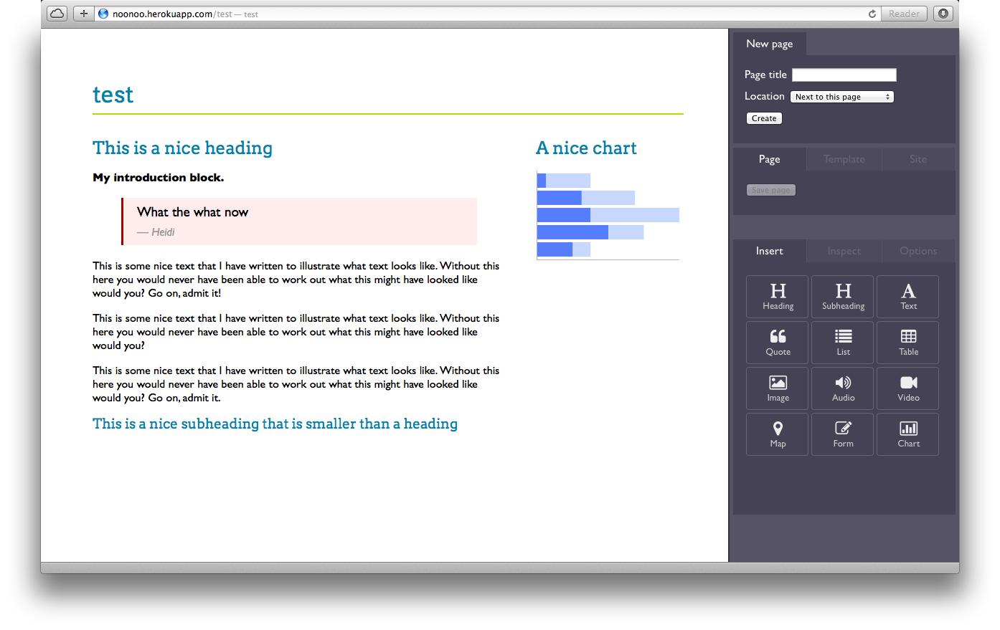

noonoo
======

Adventures in Ruby, Sinatra, <del>CouchDB</del> Mongo, Javascript, and JSON. With socket.io to follow!

A little web site editor (don't you dare say CMS) based on pages, components, templates, and maybe some other stuff in time.

Small, elegant, and surprisingly powerful.

* Editable templates (master pages)
* Drag and drop components onto pages or templates (and around them to reorganise)
* Inline editing comnbined with an inspector for the non-visual stuff
* Inter-component communication (e.g. a filter component determining what shows in a separate list component)
* Use pre-set collections of components and pages for common use cases (vertical apps)
* Web sockets for collobrative editing (instant update for all editors)

