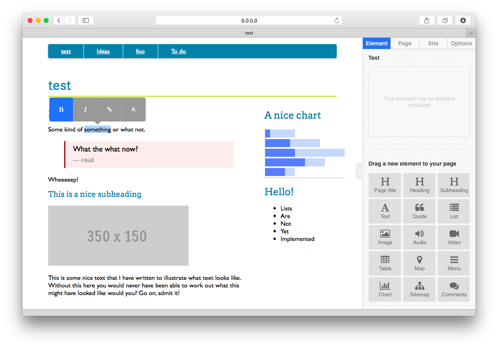

noonoo
======

Adventures in Ruby, Sinatra, <del>CouchDB</del> Mongo, Javascript, HTML5 Microdata, and JSON. With socket.io to follow!

A little web site editor (don't you dare say CMS) based on pages, components, templates, and maybe some other stuff in time.

Small, elegant, and surprisingly powerful.

The masterplan
--------------

* Editable templates (master pages)
* Drag and drop components onto pages or templates (and around them to reorganise)
* Inline editing comnbined with an inspector for the non-visual stuff
* Inter-component communication (e.g. a filter component determining what shows in a separate list component)
* Use pre-set collections of components and pages for common use cases (vertical apps)
* Web sockets for collobrative editing (instant update for all editors)
* Themeable
* Mobile preview (etc.) from within editing interface
* Super easy to use 
* Simple workflow support (draft, publish, etc.)
* Revision history, multiple undo, etc.

Tools, libraries, and what not to think about using
---------------------------------------------------

* Knockout.js to simplify the data-binding needs (or maybe something like react?)
* WebComponents (standard stuff rather than custom stuff) or Knockout.js 3.2's components?
* Socket.io for real time coolness (or something via knockout.js or similar?)
* Native JS to replace jQuery where possible (or maybe zepto.js?) - what about jQueryUI?

