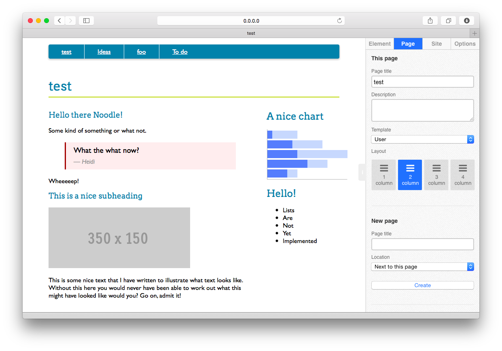

noonoo
======

Adventures in Ruby, Sinatra, <del>CouchDB</del> Mongo, Javascript, HTML5 Microdata, and JSON. With socket.io to follow!

A little web site editor (don't you dare say CMS) based on pages, components, templates, and maybe some other stuff in time.

Small, elegant, and surprisingly powerful.

Watch it in action
------------------

[Watch a screencast of a very early version in action](https://www.youtube.com/watch?v=jb8t4iftvaM)

Some piccies
------------

Getting started (untested instructions!)
----------------------------------------

First off you will need Ruby (and a relatively new version thereof). 

Use bundler to get the necessary dependencies...

        $ bundle install

You'll also need Mongo installed and running. This is configured via config/mongoid.yml. Start it up via the usual...

        $ mongod

Then to start up the app use foreman (which will fire the Unicorn server up)...

        $ foreman start

If everything is working you should now be able to see it at http://0.0.0.0:5000

Everything is Heroku friendly (assuming you have the MongoHQ database add-on ready to go).

The masterplan
--------------

* Editable templates (master pages)
* Drag and drop components onto pages or templates (and around them to reorganise)
* Inline editing comnbined with an inspector for the non-visual stuff
* Inter-component communication (e.g. a filter component determining what shows in a separate list component)
* Use pre-set collections of components and pages for common use cases (vertical apps)
* Web sockets for collobrative editing (instant update for all editors)
* Themeable
* Mobile preview (etc.) from within editing interface
* Super easy to use 
* Simple workflow support (draft, publish, etc.)
* Revision history, multiple undo, etc.
* Integration with CRMs etc. via prebuilt components

Tools, libraries, and what not to think about using
---------------------------------------------------

* Knockout.js to simplify the data-binding needs (or maybe something like react?)
* WebComponents (standard stuff rather than custom stuff) or Knockout.js 3.2's components?
* Socket.io for real time coolness (or something via knockout.js or similar?)
* Native JS to replace jQuery where possible (or maybe zepto.js?) - what about jQueryUI?
* Radius for simpler templating (bit like JSP action files)

TODOs
-----

* Stick to consitent name for elements (or components?)
* Swap in nicer templating (logic-less as possible)
* Work out how to store non-visual data with an element (stuff not exposed into HTML)
* Improve element inspecting (so can deal with nested HTML/attributes)
* Allow saving and re-application of custom user generated layouts (templates?)
* Inter-element communication (some kind of shared scope thing?) - classic e.g. filter and list
* Caching?!? How (for e.g.) avoid going to CRM API on every page load?
* How allow elements to do more than just display content? How allow input? e.g. update user details form

Woe
---

Need a much better way of wiring interface elements that allow you to change the state of the page to the things that are affected by them. Otherwise it will become a big jumble of jQuery selectors to keep everything in sync - if it isn't already. Is there way react.js could help (or something similar)?
